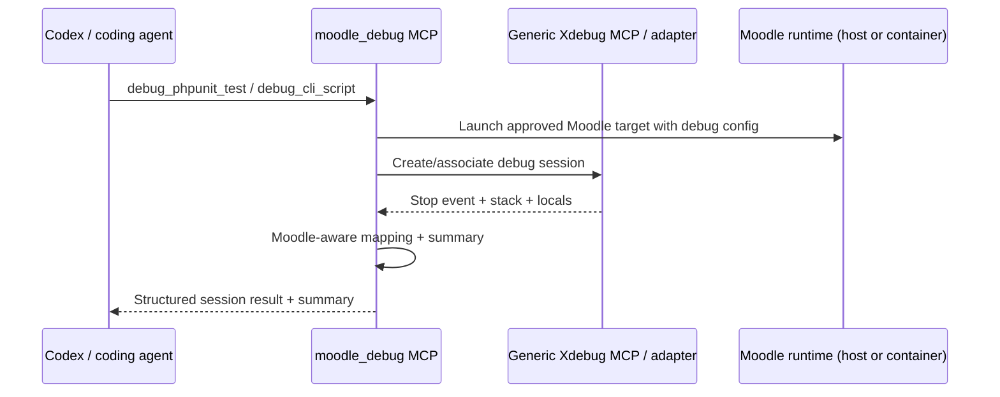

# `moodle_debug` Design and Contract Specification

## 1. Executive summary

Implementation note:

- The original design assumed a generic debugger MCP or adapter under the Moodle-aware wrapper.
- The current repository implementation keeps the same public MCP contract and internal seam, but the real backend phase uses an in-process DBGp listener implemented inside `moodle_debug` rather than depending on a separate debugger MCP.
- This keeps the architecture aligned with the original wrapper goal while staying locally scriptable and testable for PHPUnit and CLI workflows.

`moodle_debug` is a Moodle-aware MCP server that orchestrates deterministic, local debug sessions for Moodle CLI commands and PHPUnit tests by coordinating:

- a Moodle-specific launch strategy
- a generic Xdebug-capable debugger MCP or debug adapter
- a constrained interpretation layer that translates raw stack/runtime information into Moodle-relevant summaries

Problem solved:

- Raw PHP/Xdebug debugging is too low-level and operationally fragile for an agentic assistant.
- Moodle debugging has Moodle-specific launch paths, container/runtime concerns, test selectors, and path/component conventions.
- Agents need high-level, reproducible workflows such as "debug this PHPUnit test" rather than "attach, set breakpoints, step, inspect frames."

What `moodle_debug` does not do:

- It is not a PHP debugger.
- It does not implement a full PHP debug engine or replace Xdebug.
- It may speak a narrow subset of DBGp internally in order to drive Xdebug for the supported workflows.
- It does not expose raw debugger operations as public MCP tools.
- It does not provide arbitrary process attach, free-form remote debugging, browser automation, profiling, or coverage in v1.

Why this should be a Moodle-aware wrapper instead of a custom debugger:

- Xdebug and generic debugger stacks already solve low-level runtime debugging.
- Rebuilding debugger transport, stepping semantics, or attach behavior would duplicate mature infrastructure and expand risk.
- The unique missing layer is Moodle-aware orchestration:
  - launching the right target deterministically
  - applying safe defaults
  - capturing structured debug artifacts
  - mapping raw runtime data to Moodle concepts such as component, subsystem, PHPUnit test context, and likely production code

In short: `moodle_debug` should own the Moodle-specific workflow and interpretation contract, while delegating debugger mechanics to existing debugger infrastructure.

## 2. Goals and non-goals

### v1 goals

- Support deterministic debugging of a single Moodle PHPUnit test.
- Support deterministic debugging of a single Moodle CLI script invocation.
- Support break-on-exception and break-on-error oriented runs.
- Capture structured stack frames, selected locals, and session metadata.
- Produce a Moodle-aware session summary with facts, inferences, confidence, and suggested next actions.
- Return reproducible rerun commands and execution metadata.
- Enforce conservative local-only guardrails.

### Explicit non-goals

- Implementing a PHP debugger or general-purpose interactive stepping engine.
- Arbitrary attachment to already-running PHP processes.
- Full interactive debugger UI replacement.
- General web-request debugging in v1.
- Behat/browser debugging in v1.
- Profiling, tracing, or coverage workflows in v1.
- Automatic patch generation or code modification based on debug results.
- Multi-request correlation, distributed tracing, or performance analysis.

### Assumptions

- The repository using `moodle_debug` is a local Moodle development environment or tooling environment with access to a Moodle checkout.
- Xdebug is available or can be enabled in the relevant PHP runtime/container.
- Moodle entrypoints are known or can be configured.
- The primary consumer is an agentic coding assistant, not a human-operated IDE.
- The current repository implementation uses a local in-process DBGp listener as the concrete backend adapter for Xdebug-backed runs.

### External dependencies

`moodle_debug` depends on:

- Xdebug for runtime instrumentation and breakpoint/exception stop behavior
- local Moodle CLI/PHPUnit runtime, either:
  - directly on host
  - inside a configured Docker/container workflow
- a thin internal DBGp adapter layer in the current implementation

### Environmental assumptions about local Moodle development

Expected v1 environment shape:

- a Moodle checkout exists locally
- `config.php` or equivalent install indicators are present
- PHPUnit support is configured
- the runtime may be host-based or Docker-based, but must be explicitly configured
- the PHP executable/entrypoint is not guessed from arbitrary shell state

Non-assumed in v1:

- browser session orchestration
- dynamic container discovery across arbitrary environments
- support for multiple simultaneous Moodle sites in a single session unless explicitly configured

## 3. Primary use cases

### Included in v1

#### A. Debug a single Moodle PHPUnit test under Xdebug

Desired agent workflow:

1. Provide a single test selector.
2. Launch exactly one test target with debug instrumentation.
3. Stop on first exception/error or explicit configured stop condition.
4. Capture stack and selected locals.
5. Summarise likely fault in Moodle terms.

#### B. Debug a Moodle CLI script under Xdebug

Desired agent workflow:

1. Provide a CLI script path and arguments.
2. Launch the script through an approved Moodle runtime entrypoint.
3. Stop on first exception/error or configured stop condition.
4. Capture stack and selected locals.
5. Summarise likely fault in Moodle terms.

#### C. Break on exception/error

v1 should prioritize exception/error stops over interactive stepping. The main user value is deterministic failure capture, not exploratory stepping.

#### D. Inspect stack and locals

Agents need structured stack frames and a bounded subset of locals, especially around the top fault frames and selected Moodle-relevant frames.

#### E. Summarise likely fault in Moodle terms

The output should answer questions like:

- Which Moodle component or subsystem is implicated?
- Is this failing in core, plugin code, renderer code, external API, access control, form handling, or a test harness layer?
- Which frames are likely harness/noise versus business logic?
- What is the probable first actionable fault site?

### Discussed but excluded from v1

#### Single web request debugging

Useful, but deferred because it adds non-determinism:

- web server/container coordination
- request triggering
- cookies/session state
- race conditions around attach timing

Recommendation: design for future compatibility, but exclude from v1.

#### Behat/browser debugging

Strongly excluded from v1 due to:

- multiple processes
- browser orchestration
- greater flakiness
- larger artifact volume

#### Profiling/trace/coverage workflows

Explicitly excluded. These are adjacent but distinct concerns with different runtime, artifact, and privacy implications.

## 4. Proposed architecture

### Layered model

### Responsibilities by layer

#### Coding agent / Codex

- chooses a high-level debug workflow
- supplies bounded inputs
- consumes structured results
- may request follow-up summary or context mapping

Should not need to:

- manage raw breakpoints
- speak debugger protocol
- guess Moodle execution conventions

#### `moodle_debug` MCP server

Owns:

- workflow validation
- Moodle runtime discovery/config usage
- safe launch orchestration
- session metadata and artifact capture
- result normalization
- Moodle-aware interpretation and summary generation
- guardrails, size limits, and safety policies

Does not own:

- low-level debugger transport
- step semantics implementation
- arbitrary process attach
- PHP engine internals

#### Generic Xdebug/debug MCP or adapter

Owns:

- Xdebug/session transport
- stop event handling
- breakpoint/exception stop support
- stack and locals retrieval
- execution control primitives

May expose many low-level operations internally, but `moodle_debug` should use only a constrained subset in v1.

#### Moodle local runtime / Docker / entrypoints

Owns:

- actual PHP execution environment
- Moodle test and CLI command entrypoints
- container/process boundary
- Moodle installation state

### Where orchestration ends and raw debugging begins

`moodle_debug` orchestration ends at:

- selecting and launching a Moodle-approved target
- defining stop policy
- requesting stack/locals from the generic debugger
- packaging/debug summarising the result

Raw debugging begins at:

- session transport establishment
- protocol-level control messages
- stack/local retrieval mechanisms
- exception pause implementation

### State ownership

`moodle_debug` owns:

- session IDs
- launch metadata
- normalized target description
- captured stack/local snapshots
- summary artifacts
- expiry timestamps

`moodle_debug` does not own:

- persistent debugger breakpoints outside session scope
- arbitrary process lifecycle beyond launched target
- IDE/editor state
- long-term storage of sensitive runtime data by default

## 5. Tool surface proposal

### v1 design principles

- Prefer task-shaped tools over protocol-shaped tools.
- Keep the surface narrow enough for deterministic testing.
- Make low-level debugger calls internal unless a strong agent workflow requires direct exposure.

### Proposed v1 tools

1. `debug_phpunit_test`
2. `debug_cli_script`
3. `get_debug_session`
4. `summarise_debug_session`
5. `map_stack_to_moodle_context`

This is intentionally narrow. It covers launch, retrieval, summarisation, and interpretation without exposing stepping or arbitrary session mutation.

### Low-level operations kept internal or delegated

These should remain internal to `moodle_debug` or delegated to the underlying debugger layer in v1:

- `set_breakpoint`
- `step_over`
- `step_into`
- `step_out`
- `continue`
- `read_locals`
- `read_stack`
- `break_on_exception`

Reason:

- Exposing these directly pushes the agent back into fragile protocol orchestration.
- v1’s value is deterministic failure capture, not exploratory debugging.
- Internal control lets `moodle_debug` enforce size limits, stop policies, and consistent summaries.

### Tradeoff on exposing low-level operations later

Possible future addition:

- `inspect_debug_frame`
- `continue_debug_session`

But these should wait until:

- session safety rules are proven
- artifact size and timeout behavior are stable
- a concrete agent need exists that summaries cannot satisfy

### Tool contract details

#### Tool: `debug_phpunit_test`

Purpose:

- Launch a single Moodle PHPUnit test under an approved debug runtime and return a bounded session snapshot plus summary.

Why it exists:

- PHPUnit is the most deterministic high-value first workflow.
- Agents commonly need a reproducible failure explanation from a single test.

Input schema:

- `moodle_root`: absolute path to Moodle checkout
- `test_ref`: single test selector
- `runtime_profile`: named runtime profile or explicit runtime config reference
- `stop_policy`: break-on-exception/error policy
- `capture_policy`: stack/locals capture limits
- `timeout_seconds`: bounded session timeout
- `idempotency_key`: optional caller-generated key

Output schema:

- session metadata
- target metadata
- stop event metadata
- structured stack snapshot
- bounded locals snapshot
- Moodle-aware summary
- reproducible rerun information

Success shape:

- `ok: true`
- `session`
- `result`

Failure shape:

- `ok: false`
- `error`
- optional `diagnostics`

Deterministic behavior expectations:

- Launches exactly one approved PHPUnit target.
- Uses a normalized test selector format.
- Uses explicit timeout and capture limits.
- Returns stable field names and ordering semantics for frames.

Security/guardrail notes:

- Must reject multiple test selectors.
- Must reject arbitrary shell fragments.
- Must only launch via approved PHPUnit entrypoint strategy.

#### Tool: `debug_cli_script`

Purpose:

- Launch a Moodle CLI script under debug with deterministic orchestration and return a bounded session snapshot plus summary.

Why it exists:

- Moodle CLI scripts are a common debugging target and easier than web workflows.

Input schema:

- `moodle_root`
- `script_path`
- `script_args`
- `runtime_profile`
- `stop_policy`
- `capture_policy`
- `timeout_seconds`
- `idempotency_key`

Output schema:

- same top-level shape as `debug_phpunit_test`

Success shape:

- `ok: true`
- `session`
- `result`

Failure shape:

- `ok: false`
- `error`
- optional `diagnostics`

Deterministic behavior expectations:

- Only launches approved Moodle CLI paths under the configured Moodle root.
- Preserves provided arg ordering exactly.
- Rejects unsafe paths and unsupported entrypoints.

Security/guardrail notes:

- `script_path` must be inside the configured Moodle root and match allowed CLI path patterns.
- Arguments are passed as an array, never a shell string.

#### Tool: `get_debug_session`

Purpose:

- Retrieve previously captured session metadata and artifacts by session ID.

Why it exists:

- Allows safe follow-up inspection without relaunching the target.
- Avoids exposing live low-level debugger control in v1.

Input schema:

- `session_id`
- `include`: optional object supporting only `result: true|false` in v1

Output schema:

- `ok`
- `session`
- optional `result`
- optional `artifacts`

Success shape:

- Returns previously captured data only.
- No live debugger interaction required.

Failure shape:

- `SESSION_NOT_FOUND`
- `SESSION_EXPIRED`

Deterministic behavior expectations:

- Read-only.
- Returns the stored session snapshot, not a mutated live view.

Security/guardrail notes:

- Session IDs must be unguessable.
- Access is limited to local caller scope/process trust boundary.

#### Tool: `summarise_debug_session`

Purpose:

- Generate or regenerate a Moodle-aware summary from an existing captured session.

Why it exists:

- Lets summarisation evolve independently of capture.
- Enables re-summarisation if heuristics improve.

Input schema:

- `session_id`
- `summary_depth`
- `focus`

Output schema:

- structured summary payload with facts, inferences, confidence, and suggested next actions

Success shape:

- `ok: true`
- `summary`

Failure shape:

- session missing/expired
- insufficient artifacts

Deterministic behavior expectations:

- Operates only on persisted artifacts from the session.
- Does not re-run the target.

Security/guardrail notes:

- Must respect existing redactions and size limits.

#### Tool: `map_stack_to_moodle_context`

Purpose:

- Translate raw stack frames into Moodle components, subsystems, execution context categories, and likely actionable frames.

Why it exists:

- This is the core Moodle-specific interpretation layer.
- Useful both independently and as a building block for summaries.

Input schema:

- `moodle_root`
- `frames`
- optional `exception`
- optional `test_context`

Output schema:

- per-frame annotations
- execution-context classification
- candidate fault frames
- confidence-scored inferences

Success shape:

- `ok: true`
- `mapping`

Failure shape:

- malformed frames
- unsupported path context

Deterministic behavior expectations:

- Pure function over provided data and Moodle path rules.
- No target execution.

Security/guardrail notes:

- Must treat frame strings as data, not commands.

## 6. JSON schemas

The canonical schemas for v1 are included in `docs/moodle_debug/schemas/moodle_debug.schema.json`.

Schema design notes:

- JSON Schema draft 2020-12
- strongly typed objects
- explicit enums for error codes and stop reasons
- bounded arrays and length constraints where practical
- reusable definitions for:
  - session metadata
  - frame
  - locals
  - exception info
  - structured errors
  - summary payloads

## 7. Workflow definitions

The canonical stepwise workflow definitions and sequence diagrams are included in `docs/moodle_debug/workflows.md`.

## 8. Moodle-aware interpretation layer

### Purpose

Translate runtime/debug facts into Moodle-relevant explanations without overstating certainty.

### Inputs

- raw stack frames
- file paths
- class names
- function names
- exception type/message
- test context metadata
- target type (`phpunit` or `cli`)

### Output model

Every interpretation result must separate:

- facts: directly observed from runtime/debugger artifacts
- inferences: Moodle-aware conclusions drawn from heuristics
- confidence: `high`, `medium`, or `low`

### Concrete heuristics

#### Component and subsystem mapping

Path-based heuristics:

- `.../mod/<name>/...` -> plugin type `mod`, component `mod_<name>`
- `.../blocks/<name>/...` -> `block_<name>`
- `.../local/<name>/...` -> `local_<name>`
- `.../admin/tool/<name>/...` -> `tool_<name>`
- `.../question/type/<name>/...` -> `qtype_<name>`
- `.../report/<name>/...` -> `report_<name>`
- `.../theme/<name>/...` -> theme component
- `.../lib/...` with core-known subpaths -> likely core subsystem

Class/name heuristics:

- namespace prefix `core_*` or `core\\` may indicate core subsystem
- frankenstyle component names in classes, callbacks, or test names should increase confidence

#### PHPUnit recognition

Indicators:

- frame path under `/tests/`
- class name ends in `_test`
- function name begins with `test_`
- PHPUnit harness classes or vendor PHPUnit frames

Interpretation rules:

- tag harness frames as `test_harness`
- identify nearest non-harness Moodle production frame as likely actionable frame

#### Common Moodle execution contexts

Heuristics:

- renderer/output: paths or classes involving `renderer`, `output`, `mustache`
- external API/webservice: `externallib.php`, `external`, service classes
- access control/auth/session: `require_login`, capability checks, `accesslib.php`, auth classes
- form processing: `mform`, `formslib.php`, classes extending `moodleform`
- DB/data layer: `$DB` wrappers, DML classes, `dml`, DB exception classes
- plugin callback/event: observer classes, callback naming patterns, hooks
- CLI bootstrap/admin task: `admin/cli/`, `scheduled_task`, `adhoc_task`

#### Fault location inference

Candidate fault frame selection heuristic:

1. take top stack frames near stop event
2. remove known debugger/harness/vendor noise
3. prefer first Moodle frame in plugin or core business logic
4. if exception originates in a generic helper, also identify nearest caller frame with domain context

Output should include:

- `probable_fault_frame`
- `supporting_frames`
- `reasoning`
- `confidence`

#### Category detection examples

- `core`
- `plugin`
- `renderer`
- `external_api`
- `access_control`
- `form_processing`
- `database`
- `task_execution`
- `test_harness`
- `unknown`

### Honesty requirements

The server must never claim certainty unless directly supported.

Examples:

- Fact: "Top stopped frame is `/var/www/html/mod/forum/lib.php` line 123."
- Inference: "This likely implicates the `mod_forum` component."
- Confidence: `high`

- Fact: "Exception thrown from `lib/dml/moodle_database.php`."
- Inference: "The actionable cause may be an upstream caller passing invalid data."
- Confidence: `medium`

## 9. Guardrails and safety boundaries

This section is normative for v1.

### Local-only execution

- Only local host or explicitly configured local Docker/container runtimes are allowed.
- No remote hosts.
- No arbitrary network attach.

### Allowed commands and entrypoints

Only approved entrypoint families:

- Moodle PHPUnit entrypoint
- Moodle CLI PHP scripts under approved directories

Disallowed:

- arbitrary `php -r`
- arbitrary shell pipelines
- arbitrary executable targets
- attaching to pre-existing unrelated PHP processes

### Allowed working directories

- under configured `moodle_root`
- optional configured wrapper/runtime directories
- never arbitrary directories outside explicit config

### Container boundary expectations

- Runtime profile must define whether execution occurs on host or in container.
- Container selection must be explicit, not inferred from all running containers.
- The server must not scan unrelated containers.

### Process targeting restrictions

- Only processes launched by `moodle_debug` within the current request/session may be debugged.
- No PID attach in v1.

### Timeout limits

Recommended defaults:

- default timeout: 120 seconds
- max timeout: 600 seconds
- attach/session establishment sub-timeout: 15 seconds

### Output and artifact limits

Recommended defaults:

- max frames captured: 50
- max locals per frame: 20
- max serialized local value length: 2048 chars
- max combined artifact payload: 512 KB
- max transcript/event list length: 200 events

### Sanitisation and redaction

Must redact or suppress values matching sensitive patterns where possible:

- passwords
- tokens
- API keys
- session IDs
- DB credentials
- auth headers

Environment variables should be excluded by default unless whitelisted as diagnostic-safe.

### Safe handling of env vars and secrets

- Runtime env injection must be allowlisted and minimal.
- Full environment dumps are prohibited.
- Stored artifacts must contain redacted values only.

### Reproducibility expectations

The server should return:

- normalized target specification
- resolved runtime profile name
- reproducible rerun command array or structured launch recipe

But it cannot guarantee:

- identical DB state
- identical timing/race behavior
- identical container state across runs

## 10. Session/state model

### Recommended model: hybrid session-oriented

Why:

- Launch tools create short-lived sessions with persisted bounded artifacts.
- Follow-up tools read from those artifacts rather than from a live debugger.

### Session identity

Each successful launch gets:

- `session_id`: unguessable opaque identifier
- `created_at`
- `expires_at`
- `target_fingerprint`

### Persisted data

Persist for session lifetime:

- normalized input
- runtime profile used
- stop event metadata
- stack snapshot
- locals snapshot
- summary payload
- rerun metadata
- diagnostic hints

### State expiry

Recommended:

- default expiry: 1 hour
- configurable upper bound: 24 hours

Expired sessions should be unrecoverable except for minimal audit metadata if implemented.

### Artifact storage

v1 recommendation:

- local ephemeral storage only
- bounded JSON artifacts
- no long-term transcript retention by default

### Follow-up inspection safety

`get_debug_session` and `summarise_debug_session` read stored artifacts only.

No live debugger continuation in v1.

## 11. Failure modes and diagnostics

The canonical failure catalog is also encoded in the schema file. v1 should standardize these codes:

| Error code | Message style | Retryable | Diagnostic hint |
|---|---|---:|---|
| `XDEBUG_NOT_ENABLED` | concise, factual | yes | Verify Xdebug is installed/enabled in selected runtime profile |
| `DOCKER_COMPOSE_BINARY_MISSING` | concise, factual | yes | Verify the configured Docker compose command or `MOODLE_DOCKER_BIN_DIR` |
| `DOCKER_SERVICE_NOT_RUNNING` | concise, factual | yes | Start the configured Docker `webserver` service |
| `DOCKER_SERVICE_NOT_FOUND` | concise, factual | no | Verify `WEBSERVER_SERVICE` or the runtime profile service name |
| `DOCKER_EXEC_FAILED` | concise, factual | maybe | Inspect normalized docker exec command and stderr |
| `XDEBUG_CALLBACK_HOST_UNRESOLVABLE` | concise, factual | yes | Verify `host.docker.internal` or override `xdebug_client_host` |
| `DEBUGGER_TRANSPORT_UNAVAILABLE` | concise, factual | yes | Verify generic debugger service/adapter is reachable |
| `TARGET_FAILED_BEFORE_ATTACH` | concise, factual | maybe | Check command/bootstrap failure and runtime logs |
| `NO_STOP_EVENT` | concise, factual | yes | Increase timeout or verify stop policy and reproducibility |
| `SESSION_TIMEOUT` | concise, factual | yes | Re-run with larger timeout if justified |
| `INVALID_TEST_REF` | precise validation error | yes | Use a single valid Moodle PHPUnit test selector |
| `INVALID_SCRIPT_PATH` | precise validation error | yes | Provide a Moodle CLI script path under allowed directories |
| `MOODLE_ROOT_NOT_FOUND` | concise, factual | yes | Verify the configured Moodle checkout path |
| `MOODLE_CONFIG_MISSING` | concise, factual | yes | Ensure Moodle install/config is present |
| `PHPUNIT_NOT_CONFIGURED` | concise, factual | yes | Verify PHPUnit setup for this Moodle checkout |
| `CONTAINER_RUNTIME_UNAVAILABLE` | concise, factual | yes | Verify configured container/service is running |
| `STACK_CAPTURE_TRUNCATED` | warning style | n/a | Reduce stack depth or inspect top frames only |
| `LOCALS_CAPTURE_TRUNCATED` | warning style | n/a | Inspect selected frames only; locals were size-limited |
| `SESSION_NOT_FOUND` | concise, factual | yes | Session may be wrong or expired |
| `SESSION_EXPIRED` | concise, factual | yes | Re-run the debug target |
| `SUMMARY_UNCERTAIN` | explicit uncertainty | n/a | Review raw stack and related frames |
| `INTERNAL_ORCHESTRATION_ERROR` | concise, factual | maybe | Inspect server logs and backend diagnostics |

Behavior requirements:

- Errors must include machine-readable `code`.
- Messages should be short and factual, not verbose stack dumps.
- Diagnostics may include bounded hints and captured backend status, but never raw secrets.

## 12. Output artifacts

### v1 successful run artifacts

- session metadata
- normalized target metadata
- stop reason
- exception summary if present
- structured stack frames
- bounded locals for selected frames
- per-frame Moodle annotations
- probable fault location
- suggested next actions
- reproducible rerun command or structured launch recipe
- debug transcript metadata (event counts/timestamps), not full verbose transport logs

### Not in v1

- full debugger traffic transcript
- arbitrary heap dumps
- profiling traces
- coverage reports
- browser/network recordings

## 13. Testing strategy for the design

Future implementation should include:

### Contract tests

- validate every tool input/output against JSON Schema
- golden tests for success and failure payloads

### Unit tests

- path-to-component mapping
- frame categorisation
- fault-frame selection heuristics
- redaction behavior

### Integration tests

- PHPUnit workflow against a controlled failing Moodle test
- CLI workflow against a controlled failing CLI script
- stop-on-exception behavior
- timeout/failure path behavior

### Smoke tests

- mocked backend smoke tests for server startup and tool surface
- optional local real-runtime smoke tests under `/_smoke_test`

### Failure-path coverage

- Xdebug disabled
- debugger unavailable
- malformed selectors
- missing config
- no stop event
- truncated artifacts
- expired sessions

## 14. Phased implementation plan

### Phase 1: contract/spec finalisation

- finalize tool list
- finalize runtime profile config model
- finalize schema/error catalog
- add ADR documenting wrapper-over-debugger decision

### Phase 2: server skeleton + mocked backend

- MCP server skeleton
- schema validation
- in-memory session store
- mocked generic debugger adapter
- contract tests

Why second:

- validates interface before real debugger coupling

### Phase 3: PHPUnit workflow

- runtime profile resolution
- PHPUnit target validation
- launch orchestration
- stop capture
- artifact persistence

Why first real workflow:

- most deterministic and highest value

### Phase 4: CLI workflow

- allowed CLI path validation
- argument-safe launch handling
- shared capture pipeline reuse

### Phase 5: summarisation + Moodle-aware interpretation

- stack mapping heuristics
- confidence scoring
- summary generation
- golden tests using stored artifacts

### Phase 6: docs/tests/smoke validation

- end-to-end docs
- local smoke tests under `/_smoke_test`
- failure-path integration coverage

## 15. Open questions and decisions needed

| Question | Why it matters | Default recommendation | Blocks v1 |
|---|---|---|---:|
| What generic debugger MCP/adapter is the concrete backend? | Tool capability and transport assumptions depend on it | Pick one adapter and code to a thin internal abstraction | yes |
| How are runtime profiles configured? | Host vs Docker launch semantics must be explicit | Use a checked-in config file with named profiles | yes |
| What PHPUnit selector format should be canonical? | Determinism and validation depend on this | Accept one canonical selector plus optional file/filter expansion later | yes |
| Which CLI directories are allowlisted in v1? | Needed for safety | Start with `admin/cli`, `lib/classes/task`, and explicitly configured extras | yes |
| Should the launch happen via host shell or container exec wrapper? | Impacts reproducibility and safety | Require explicit per-profile launcher command array | yes |
| How much locals data is safe to persist? | Artifact size and secret risk | Persist only bounded, redacted top-frame locals | no |
| Should sessions survive process restart? | Affects store choice | No for v1; use ephemeral store | no |
| Is there an existing local convention for Moodle Docker service names? | Needed for smooth onboarding | Do not assume; make it explicit in config | no |
| Should warnings like truncation be returned as errors or side-channel warnings? | Affects contract clarity | Use `warnings[]` alongside successful results | no |
| Do we need follow-up live stepping in v1.1? | May affect state model | No; defer until static capture proves insufficient | no |

## 16. Recommended repository outputs

Recommended design-phase files:

- `docs/moodle_debug/design.md`
- `docs/moodle_debug/workflows.md`
- `docs/moodle_debug/schemas/moodle_debug.schema.json`
- `docs/moodle_debug/adr/0001-wrapper-not-debugger.md`
- `docs/moodle_debug/implementation_plan.md`

Why these files:

- `design.md`: single authoritative architecture and contract handoff
- `workflows.md`: exact sequences and Mermaid diagrams
- `schemas/...json`: machine-usable source of truth for implementation and tests
- ADR: records the key architectural decision not to build a custom debugger
- implementation plan: turns the design into discrete execution phases

Phase 2 cleanup note:

- `session.runtime_profile.launcher_kind` now truthfully mirrors the runtime profile kind and only allows `phpunit` or `cli`
- `get_debug_session.include` is intentionally limited to `result: true|false`; finer-grained artifact pruning is deferred

## Recommended next Codex prompt

Ask Prompt 2 to implement the repository scaffolding for `moodle_debug` from this design, but only through the mocked backend milestone:

"Using the design docs in `docs/moodle_debug/`, implement Phase 2 of `moodle_debug`: create the MCP server skeleton, config/runtime profile model, JSON-schema-backed request/response validation, in-memory session store, mocked generic debugger adapter, and contract tests for all v1 tools. Do not implement real Xdebug transport yet. Keep the code narrow, well-tested, and aligned exactly to the design contracts."
