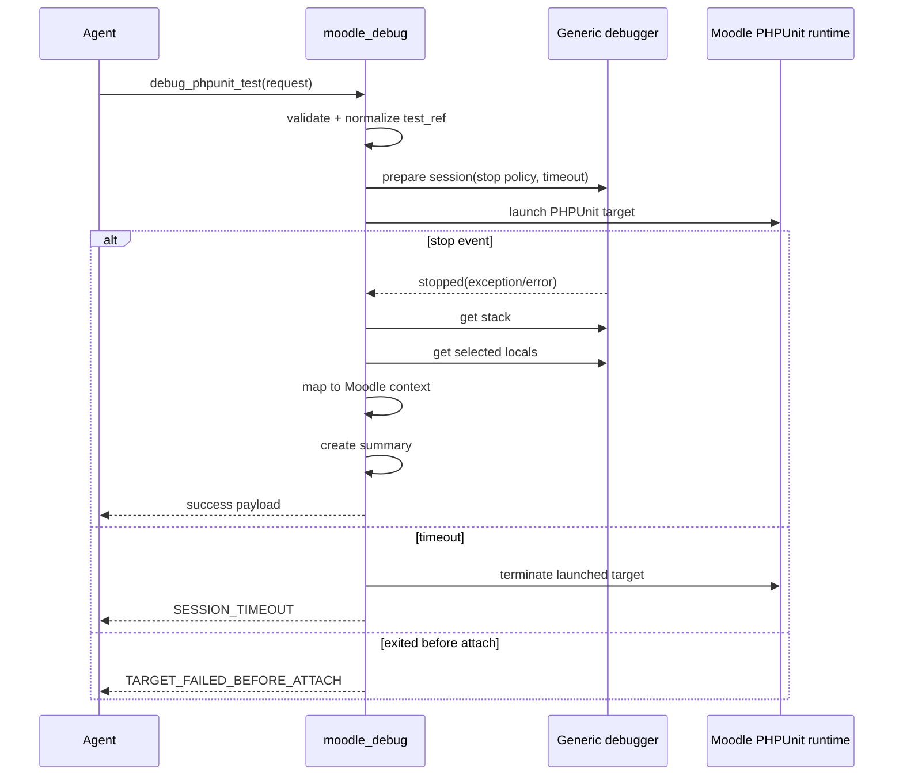
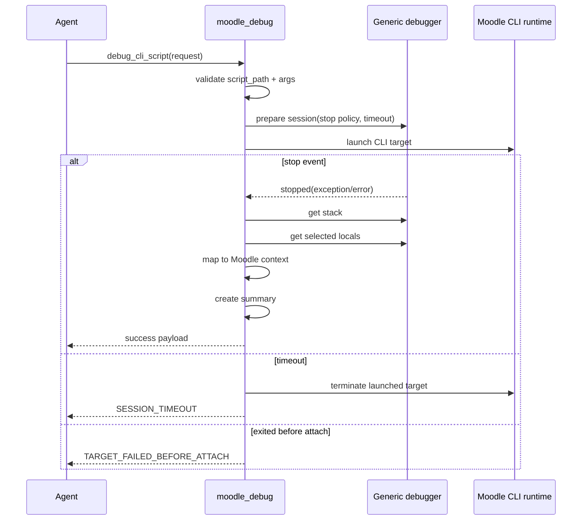

# `moodle_debug` Workflow Definitions

## Scope

This document defines the exact v1 workflows for:

- PHPUnit debug workflow
- CLI debug workflow

It also defines:

- preconditions
- launch rules
- stop behavior
- capture behavior
- timeout/failure handling
- determinism guarantees and non-guarantees

## Shared workflow concepts

### Preconditions

Before any launch, `moodle_debug` must verify:

1. `moodle_root` exists and is absolute.
2. `moodle_root` appears to be a Moodle checkout.
3. required local config/install markers exist.
4. runtime profile exists and is allowed.
5. generic debugger backend is configured and reachable enough to attempt session setup.

If any precondition fails, return a structured error before launch.

### Shared stop policy

v1 stop policy should be constrained to:

- `first_exception`
- `first_error`
- `first_exception_or_error`
- `never` only if a future workflow explicitly needs it; recommended to reject in v1 launch tools

Default:

- `first_exception_or_error`

### Shared capture policy

Capture policy fields:

- `max_frames`
- `max_locals_per_frame`
- `max_string_length`
- `include_args`
- `include_locals`
- `focus_top_frames`

Recommended defaults:

- `max_frames = 25`
- `max_locals_per_frame = 10`
- `max_string_length = 512`
- `include_args = true`
- `include_locals = true`
- `focus_top_frames = 5`

### Shared artifacts returned

Successful stopped session returns:

- session metadata
- launch metadata
- stop event
- bounded stack
- bounded locals
- warnings
- Moodle-aware mapping
- summary
- rerun recipe

## PHPUnit debug workflow

### Preconditions

Required:

1. valid `moodle_root`
2. Moodle config/install present
3. PHPUnit configured for this checkout
4. `test_ref` parses as exactly one test target
5. runtime profile is available
6. debugger backend is available enough to attempt session creation

### Launch model

The server must not accept arbitrary shell command input.

Instead it builds a target launch recipe:

1. resolve runtime profile
2. resolve PHPUnit entrypoint strategy
3. normalize test selector
4. construct argv array
5. inject only approved debug env/config for the selected profile

Example logical launch recipe:

```json
{
  "launcher": ["docker", "exec", "-i", "moodle-php"],
  "command": ["php", "vendor/bin/phpunit", "--filter", "test_something", "mod/forum/tests/example_test.php"],
  "cwd": "/var/www/html",
  "env_policy": "debug_profile_minimal"
}
```

The exact launcher may differ by profile, but must be represented as structured argv, never as a shell string.

### Exact workflow sequence

1. Validate request schema.
2. Resolve `moodle_root`.
3. Detect Moodle install/config markers.
4. Resolve runtime profile.
5. Validate PHPUnit readiness.
6. Parse and normalize `test_ref`.
7. Create a pending `session_id`.
8. Instruct generic debugger backend to prepare a launch-bound session with stop policy.
9. Launch the PHPUnit target through the approved launcher.
10. Wait for one of:
   - debugger stop event
   - target exit before attach
   - timeout
11. If stop event occurs:
   - capture stop reason
   - capture exception metadata if present
   - request stack frames
   - request locals for selected frames according to capture policy
12. Normalize stack/local artifacts.
13. Run Moodle-aware stack mapping.
14. Generate summary payload.
15. Persist bounded session artifacts.
16. Return structured success payload.

### Break-on-exception behavior

Default:

- enable break on first exception or error before launch begins

Rationale:

- maximizes deterministic failure capture
- minimizes agent need for manual stepping

### How stack/locals are captured

Rules:

1. capture stack immediately after stop event
2. capture locals only for top N frames or explicitly selected actionable frames
3. apply redaction before persistence
4. mark truncation in `warnings[]`

### Returned artifacts

- `session`
- `target.type = "phpunit"`
- `target.normalized_test_ref`
- `stop_event`
- `exception`
- `frames[]`
- `locals_by_frame`
- `moodle_mapping`
- `summary`
- `rerun`
- `warnings[]`

### Failure and timeout handling

If debugger not available:

- fail before launch if possible with `DEBUGGER_TRANSPORT_UNAVAILABLE`

If target exits before attach:

- return `TARGET_FAILED_BEFORE_ATTACH`

If no stop event before timeout:

- terminate launched target if still running
- return `SESSION_TIMEOUT` or `NO_STOP_EVENT` depending on observed state

### Determinism guarantees

Can reasonably guarantee:

- one normalized test target
- one explicit launcher recipe
- one configured stop policy
- bounded artifacts

Cannot guarantee:

- same database state
- same fixture state unless caller ensures it
- identical race-sensitive behavior

### PHPUnit sequence diagram



## CLI debug workflow

### Preconditions

Required:

1. valid `moodle_root`
2. Moodle config/install present
3. `script_path` is relative to or resolves under `moodle_root`
4. `script_path` matches allowed CLI patterns
5. `script_args` is a structured string array
6. runtime profile is available
7. debugger backend is available enough to attempt session creation

### Allowed script path rules

Initial allowlist recommendation:

- `admin/cli/*.php`
- explicitly configured allowlist prefixes under the Moodle root

Strong recommendation:

- do not allow arbitrary PHP files under the tree in v1

### Exact workflow sequence

1. Validate request schema.
2. Resolve `moodle_root`.
3. Detect Moodle install/config markers.
4. Resolve runtime profile.
5. Validate `script_path`:
   - normalized path
   - under `moodle_root`
   - matches allowlist
6. Validate `script_args` as structured array.
7. Create pending `session_id`.
8. Instruct generic debugger backend to prepare a launch-bound session with stop policy.
9. Launch the CLI target through the approved launcher.
10. Wait for:
   - debugger stop event
   - target exit before attach
   - timeout
11. If stop event occurs:
   - capture stop reason
   - capture exception metadata if present
   - request stack frames
   - request bounded locals
12. Normalize artifacts.
13. Run Moodle-aware mapping.
14. Generate summary.
15. Persist session artifacts.
16. Return structured success payload.

### Break-on-exception behavior

Same default as PHPUnit:

- `first_exception_or_error`

### Returned artifacts

- `session`
- `target.type = "cli"`
- `target.script_path`
- `target.script_args`
- `stop_event`
- `exception`
- `frames[]`
- `locals_by_frame`
- `moodle_mapping`
- `summary`
- `rerun`
- `warnings[]`

### Failure and timeout handling

Same handling model as PHPUnit, plus:

- invalid path -> `INVALID_SCRIPT_PATH`
- disallowed path -> `INVALID_SCRIPT_PATH`

### Determinism guarantees

Can reasonably guarantee:

- exact argv ordering
- explicit launcher recipe
- bounded artifacts

Cannot guarantee:

- external service side effects invoked by the CLI script
- identical DB/file state across runs

### CLI sequence diagram



## What v1 can and cannot guarantee

### v1 can guarantee

- narrow, validated launch shapes
- approved target classes only
- no arbitrary attach
- bounded structured artifacts
- explicit error codes

### v1 cannot guarantee

- exact replay of mutable state
- diagnosis correctness beyond available runtime facts
- stable behavior for non-deterministic or race-sensitive failures

## Recommended future extension points

Not part of v1, but preserved by the workflow design:

- web-request launch adapter
- browser/Behat orchestration adapter
- optional follow-up frame inspection tool
- optional live continue/step tool under stricter session control
